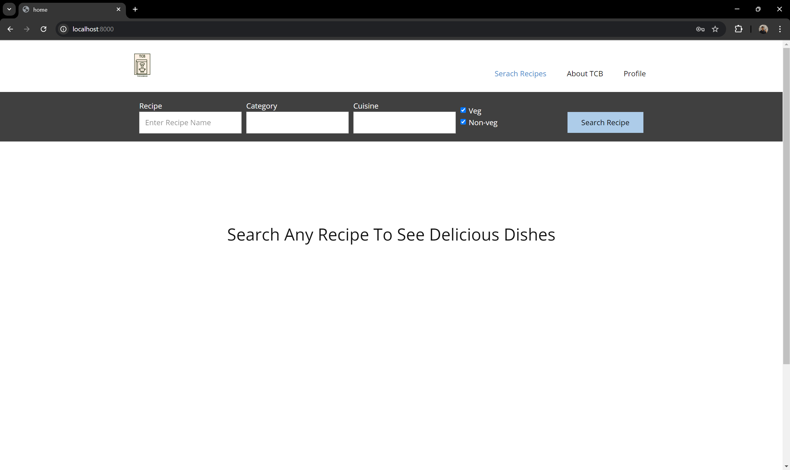
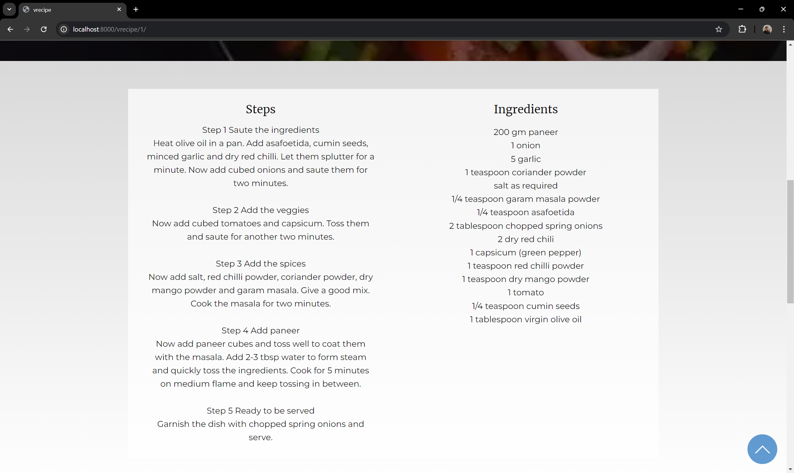
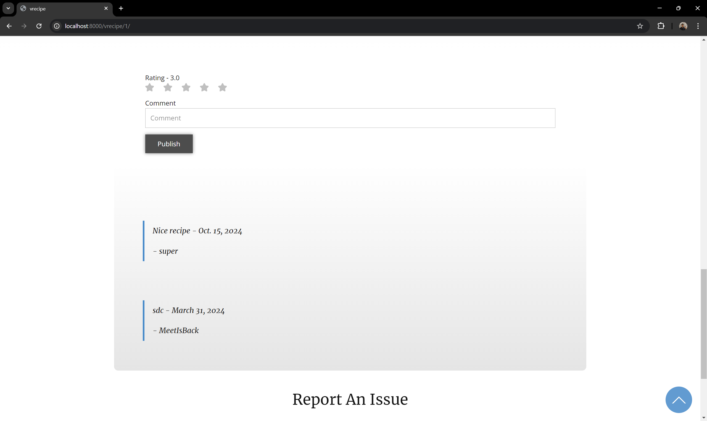
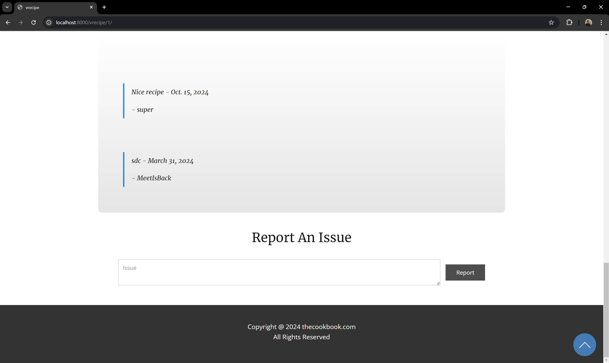
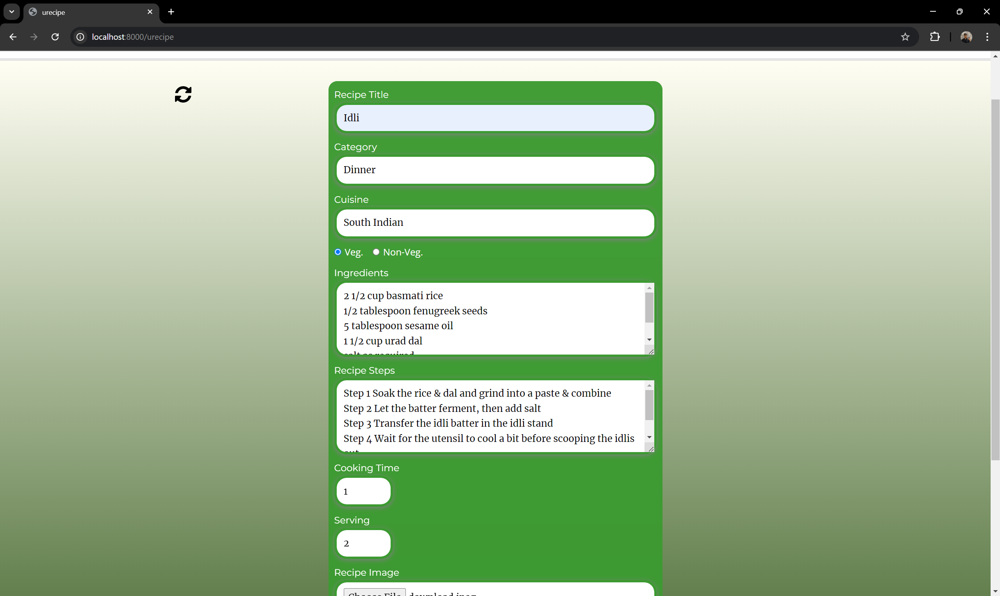
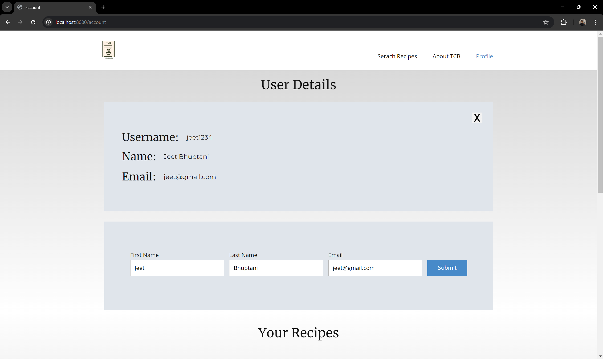
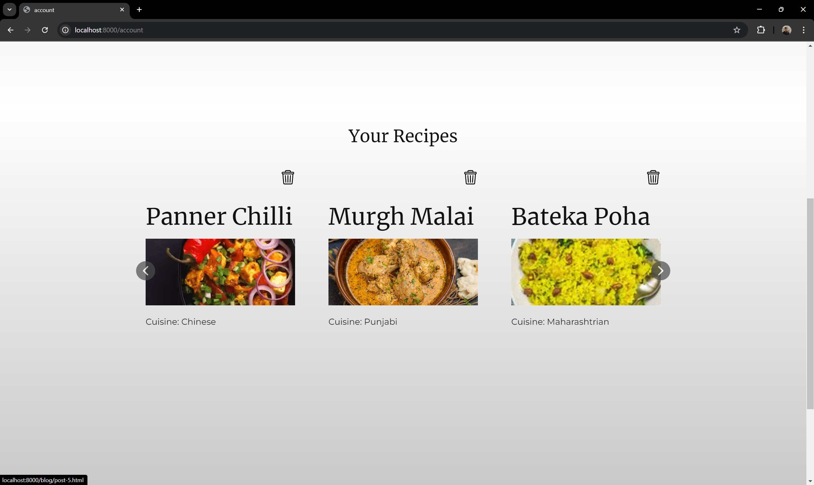

# The Cook Book (TCB)

This is a Django Project build for Semester 4 SP subject final submission, The Cook Book is a Online Recipe Book which allows user to search and upload food recipes, rate and review food recipes.


## Authors/Developers

- [@jeetbhuptani](https://www.github.com/jeetbhuptani)
- [@meetdobariya](https://github.com/Meet9399)


## Contributing

Contributions are always welcome!
We would love to work further on this project after starting of May 2024 


## Deployment

To deploy this project
Requiered python insalled

Open terminal for project directory

1. install django 
```bash
...\> pip install Django
```

2. install bootstrap and image pips for the django
```bash
...\> pip install django-bootstrap-v5'
```
```bash
...\> pip install Pillow
```
3. Run 
```bash
...\> python manage.py runserver 
```
4. Demo
```bash
open http://127.0.0.1:8000/
```

## Features

- search recipe
  





- comment and rate recipe



- report recipe



- upload recipe



- View profile



- View & Delete own recipe



## Tech Stack

**Client:** HTML, CSS, Javascript

**Server:** Django 

